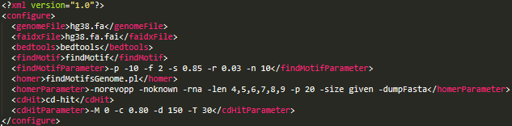
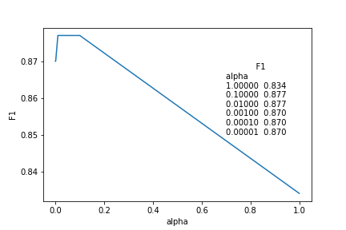
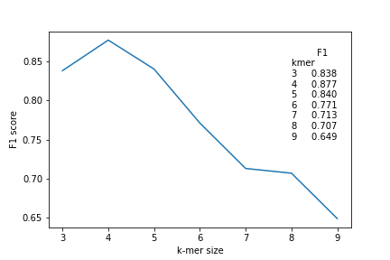
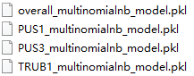

# psiMNB

## Active learning approach of Multinomial Naive Bayes for finding PUS-dependent pseudouridylation


## Contents
- [Pre-installation](#pre-installation)
- [Input data](#input-data)
- [Usage](#Usage)
  - [Generate training dataset](#generate-training-dataset)
  - [Determine k-mer](#determine-k-mer)
  - [Build MNB model](#build-MNB-model)

### Pre-installation
**psiMNB** is a training workflow for building Multinomial Naive Bayes (MNB) models of PUS label/probability prediction using active learning approach. psiMNB requires **homer(findMotifsGenome.pl)/bedtools/cd-hit and several R packages** pre-installation and predominantly used in unix-based operating systems. Therefore, for the usability of **psiMNB**, we recommend running all the tools and scripts in WSL2 (WSL2 installation guide: https://pureinfotech.com/install-windows-subsystem-linux-2-windows-10/) or unix-based system with R and python.

```R
#use pacman to install packages in batch

install.packages("pacman")
library(pacman)

#load and install required R packages 
p_load('optparse','openxlsx','dplyr','ggplot2','RColorBrewer','optparse','motifStack','gridGraphics','stringr')
```
### Input data
Test data: human_PUS_MNB_input_k-mer_overall.txt, human_PUS_MNB_input_k-mer_TRUB1.txt, human_PUS_MNB_input_k-mer_PUS3.txt, human_PUS_MNB_input_k-mer_PUS1.txt. (i.e. training dataset, result generated by **findMotif.sh**)

### Usage

#### Generate training dataset

Run **findMotif.sh** to automatically invoke motifFinding.pl and motifStack_vis.r (to generate motif clustering result)

> **Notice:** **findMotif.sh** require motifConfigure_hg38.xml file configuration setting. required files: hg38.fa/hg38.fa.fai; required tools to be installed: bedtools, homer (findMotifsGenome.pl), cd-hit



```shell
bash findMotif.sh ePSI_seq_total_polyA_Day0_mix.bed Day0_common_anno_group_redundance_mix.txt
# name of 'ePSI_seq_total_polyA_Day0_mix.bed' should be correspond to (One on One) name column of 'Day0_common_anno_group_redundance_mix.txt' (the former is provided to offer genome location, the latter is provided to offer annotation for each observation in the former)
```

Finally, based on the output file ('findMotif_pssm_append_info.xlsx' suffix) generated from **findMotif.sh**, manually organizate input dataset like the [input data](#input-data) (a two-column txt file with the first column as 20nt extended sequence and the second as assigned labels based on known tRNA Ψ-sites evidence)

#### Determine k-mer
```python
python build_psi_MNB_overall_test_kmer.py # input data: human_PUS_MNB_input_k-mer_overall.txt is loaded
```

 

#### Build MNB model and run prediction
```python
python build_psi_MNB_overall.py # input data: human_PUS_MNB_input_k-mer_overall.txt is loaded
python build_psi_MNB_TRUB1.py # input data: human_PUS_MNB_input_k-mer_TRUB1.txt is loaded
python build_psi_MNB_PUS3.py # input data: human_PUS_MNB_input_k-mer_PUS3.txt is loaded
python build_psi_MNB_PUS1.py # input data: human_PUS_MNB_input_k-mer_PUS1.txt is loaded
```



