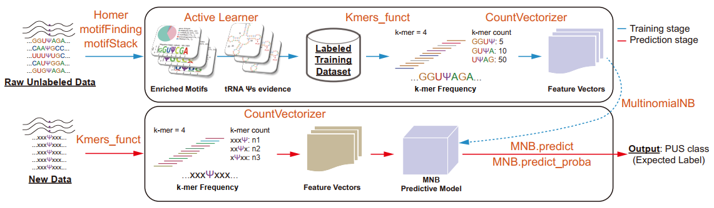

# psiMNB

## Active learning approach of Multinomial Naive Bayes for finding PUS-dependent pseudouridylation



## Contents
- [pre-installation](#pre-installation)
- [input data](#input-data)
- [Usage](#Usage)
  - [generate training dataset](#generate-training-dataset)
  - [determine k-mer](#determine-k-mer)
  - [build MNB model](#build-MNB-model)

### pre-installation
**psiMNB** is a training workflow for building Multinomial Naive Bayes (MNB) models of PUS label/probability prediction using active learning approach. psiMNB requires **homer/motifFinding/motifStack** pre-installation and predominantly used in unix-based operating systems. Therefore, for the usability of **psiMNB**, we recommend running **homer/motifFinding/motifStack** and all the scripts in WSL2 (WSL2 installation guide: https://pureinfotech.com/install-windows-subsystem-linux-2-windows-10/) or unix-based system with R and python.

```R
#use pacman to install packages in batch

install.packages("pacman")
library(pacman)

#load and install required R packages 
p_load('optparse','openxlsx','dplyr','ggplot2','RColorBrewer','optparse','motifStack','gridGraphics','stringr')
```
### input data
Test data: human_PUS_MNB_input_k-mer_overall.txt, human_PUS_MNB_input_k-mer_TRUB1.txt, human_PUS_MNB_input_k-mer_PUS3.txt, human_PUS_MNB_input_k-mer_PUS1.txt. (i.e. training dataset, result generated by **homer/motifFinding/motifStack**)

### Usage

#### generate training dataset

Run **motifFinding** to invoke homer and get motifFinding clustering result: full_gene_contigs.bed6 is the bed6 file containing all the input Ψ-sites
```shell
./motifFinding ePSI_seq_total_polyA_Day0_mix_motifs/full_gene_HomerGenomeResults/full_gene_contigs.bed6 hg38 ePSI_seq_total_polyA_Day0_mix_motifs/full_gene_HomerGenomeResults -norevopp -noknown -rna -len 4,5,6,7,8,9 -p 20 -size given -dumpFasta
```

Run **findMotif_pssm_all.sh** to visualize significantly enriched motifs and corresponding metagene plot of mRNA:

💡 **findMotif_pssm_all.r** require invoking the metagene.sh (provided in **psiFinder** package: https://mega.nz/folder/oaUmhK7I#gSuYH4HW7OhL5qEbgmw0fw).

💡 if you want all the motif and metagene result plot concatenated in one file, you also need to ensure you can run **mutool** and **mupdf-x11** function in your terminal.

```shell
cd ePSI_seq_total_polyA_Day0_mix_motifs/full_gene_HomerGenomeResults
bash findMotif_pssm_all.sh Day0_common_anno_group_redundance_mix.xlsx ePSI_seq_total_polyA_Day0_mix_motifs.full_gene.significant.positionSpecifc.motifs.sequences.txt ePSI_seq_total_polyA_Day0_mix_motifs.full_gene.significant.positionSpecifc.motifs.txt Day0_mix > Day0_mix.log 2>&1 &
```

Finally, manually generate input dataset like the [input data](#input-data) (a two-column txt file with the first column as 20nt extended sequence and the second as assigned labels based on known tRNA Ψ-sites evidence)

#### determine k-mer
```python
python build_psi_MNB_overall_test_kmer.py # input data: human_PUS_MNB_input_k-mer_overall.txt is loaded
```

#### build MNB model
```python
python build_psi_MNB_overall.py # input data: human_PUS_MNB_input_k-mer_overall.txt is loaded
python build_psi_MNB_TRUB1.py # input data: human_PUS_MNB_input_k-mer_TRUB1.txt is loaded
python build_psi_MNB_PUS3.py # input data: human_PUS_MNB_input_k-mer_PUS3.txt is loaded
python build_psi_MNB_PUS1.py # input data: human_PUS_MNB_input_k-mer_PUS1.txt is loaded
```
